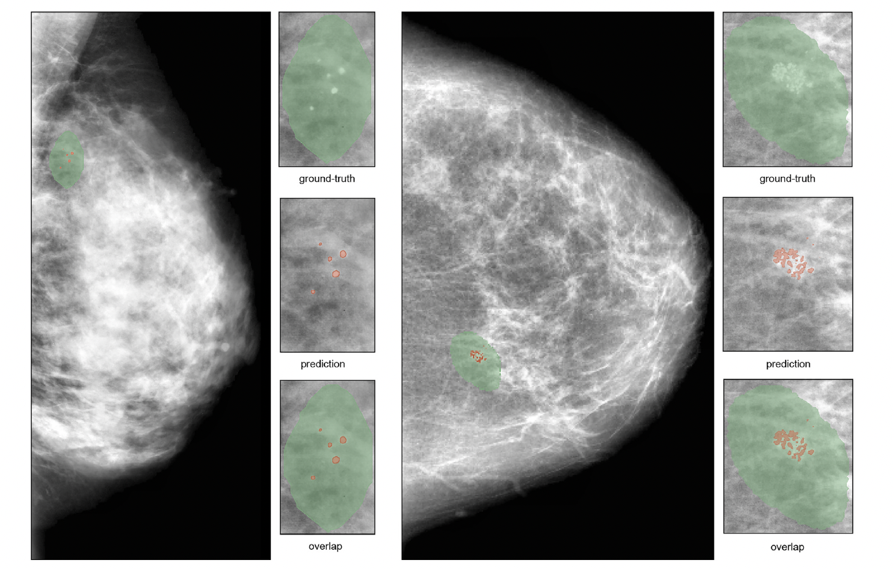

# DeepMiCA: automatic segmentation and classification of breast MIcroCAlcifications from mammograms

Official Repo of the paper [DeepMiCa: automatic segmentation and classification of breast MIcroCAlcifications from mammograms](https://doi.org/10.1016/j.cmpb.2023.107483) - [Alessia Gerbasi](https://scholar.google.com/citations?user=zzZZp_UAAAAJ&hl=it) et al.
_____________________________________________________________________________________________________________
<span style="color: red;">NEWS! - 10.06.2025 </span>

Due to the high number of submissions we have now removed the form for checkpoints requests.
You can direclty download them from [here](https://drive.google.com/file/d/1hHZ8I76zHQPQ64RYR2gWSKNKoCWH64CZ/view?usp=share_link)
_____________________________________________________________________________________________________________


Breast microcalcifications may be the very early and only first detectable sign of breast cancer.
However, they are by definition small calcium deposits with less than 1 mm in diameter, and their early detection and classification is still a very challenging task, often requiring an invasive biopsy.


DeepMiCa can help to automate the whole process with a customisable accurate and visually explainable deep learning pipeline designed to support the clinicians during breast screening.
The proposed pipeline pre-processes, segments and classifies microcalcifications from mammograms.
The main steps are schematically represented in the following figure. Please refer to the paper for more details.


### Python requirements 
python > 3.7.
All the required packages are listed in the `requirements.txt` file.

### Datasets
The datasets used in this work are publicly available at the [Curated Breast Imaging Subset of DDSM (CBIS-DDSM)](https://wiki.cancerimagingarchive.net/pages/viewpage.action?pageId=22516629)
and the [INbreast](https://www.kaggle.com/datasets/ramanathansp20/inbreast-dataset). 
For a full description of the datasets, please refer to the paper and the original sources.

### Project structure
This is the tree structure of the folders you should have to directly use our code:
``` 
├── Step1_Preprocessing
│   └── preprocessing.py
│
├── Step2_Segmentation
│   ├── _01_SplitData
│   │   └── split.py
│   ├── _02_Patches
│   │   ├── create_patches.py
│   │   └── reduce_patches.py
│   ├── _03_Train
│   │   ├── LoadData.py
│   │   ├── Losses.py
│   │   ├── main.py
│   │   ├── SegmentationDataset.py
│   │   ├── train.py
│   │   └── UNet.py
│   ├── _04_Test
│   │   └── testing.py
│   └──  Checkpoints
│
├── Step3_Classification
│   ├── _01_CutROI
│   │   └── cut_ROI.py
│   ├── _02_SplitData
│   │   └── split.py
│   ├── _03_FeatureExtraction
│   │   ├── CustomDataset.py
│   │   ├── LoadData.py
│   │   ├── main.py
│   │   ├── Resnet18.py
│   │   ├── train.py
│   │   └── Vgg16.py
│   ├── _04_FineTuning
│   │   └── fineTuning.py
│   └── _05_Test
│       └── testing.py
│
└── Datasets
    ├── INbreast
    │   ├── AllPng
    │   │   ├── 20586908.png
    │   │   ├── 20586934.png
    │   │   ├── ...    
    │   ├── Masks
    │   │   ├── 20586908.png
    │   │   ├── 20586934.png
    │   │   ├── ...   
    │   └── csv
    │       └── INbreast_table_noClusters.csv
    └── CBIS_DDSM
        ├── AllPng
        │   ├── 00005_RIGHT_CC.png
        │   ├── 00007_LEFT_CC.png
        │   ├── ...    
        ├── Masks
        │   ├── 00005_RIGHT_CC_1.png
        │   ├── 00007_LEFT_CC_1.png
        │   ├── ...   
        └── csv
            └── CBIS_DDSM.csv
``` 

### Reproducing the experiments
Our pipeline is designed to be as flexible as possible therefore, we provide a set of progressively numbered folders containing the scripts for each step. 
According to your needs, you can choose to run all the steps or jump to the one you are interested in.
If your input dataset is different, or you did not structure the data folders as we did, you can easily change the paths in the scripts.

- **Step1_Preprocessing**
  - `preprocessing.py`: this step is designed to preprocess the images from both datasets before the segmentation step in order to remove artifacts and enhance the contrast.
  

- **Step2_Segmentation**
  - **_01_SplitData** 
    - `split.py`: splits the images from INbreast dataset into training, validation and test sets.
  - **_02_Patches**
    - `create_patches.py`: create 256x256 pixels patches from images of both datasets.
    - `reduce_patches.py`: you can run this script to remove the completely black patches from the training set.
  - **_03_Train**
    - `main.py`: this is the main script to train the model that recalls all the other files in the folder.
       You can visualize the learning curves with [wandb](https://wandb.ai/site) while training.
       The best weights will be saved in a folder called `Checkpoints`.
  - **_04_Test**
    - `test.py`: you can call this script to test the model on the test set.
    

- **Step3_Classification**
   - **_01_CutROI**
     - `cut_roi.py`: in this script we cut the minimum bounding box including the segmented microcalcification from CBIS-DDSM dataset.
   - **_02_SplitData** 
     - `split.py`: splits the ROIs to be classified into training, validation and test sets.
   - **_03_FeatureExtraction**
     - `main.py`: this is the main script to train the model that recalls all the other files in the folder. 
        The best weights will be saved in a folder called `Checkpoints`. 
        You can visualize the learning curves with [wandb](https://wandb.ai/site) while training.
        For hyperparameters tuning with RayTune, please refer to the [RayTune documentation](https://docs.ray.io/en/master/tune/index.html).
   - **_04_FineTuning**
     - `finetuning.py`: this is the main script to fine-tune the model that recalls all the other files in the folder.
        The best weights will be saved in a folder called `Checkpoints`.
        You can visualize the learning curves with [wandb](https://wandb.ai/site) while training.

###### Results
For a rapid visual assessment of the results we show here (1) A comparison between original CBIS-DDSM ground-truth masks and our segmentation results and (2) two examples of classification results and corresponding XAI maps.
Please refer to the paper for a full description and discussion of the results.
<figure>
  
 </figure>

<figure>
  
</figure>


### Pre-trained models
If you want to directly test our models, you can request the models weights and put them in the `Checkpoints` folder.
Then you can run the following scripts:
- `python3 Step2_Segmentation/_04_Test/testing.py` to test the segmentation model on your test set.
- `python3 Step3_Classification/_05_Test/testing.py` to test the classification model on your test set.

### Citation
If you find this code useful for your research, please cite our paper:
```
@article{gerbasi2023deepmica,
  title={DeepMiCa: Automatic segmentation and classification of breast MIcroCAlcifications from mammograms},
  author={Gerbasi, Alessia and Clementi, Greta and Corsi, Fabio and Albasini, Sara and Malovini, Alberto and Quaglini, Silvana and Bellazzi, Riccardo},
  journal={Computer Methods and Programs in Biomedicine},
  volume={235},
  pages={107483},
  year={2023},
  publisher={Elsevier}
}
```
